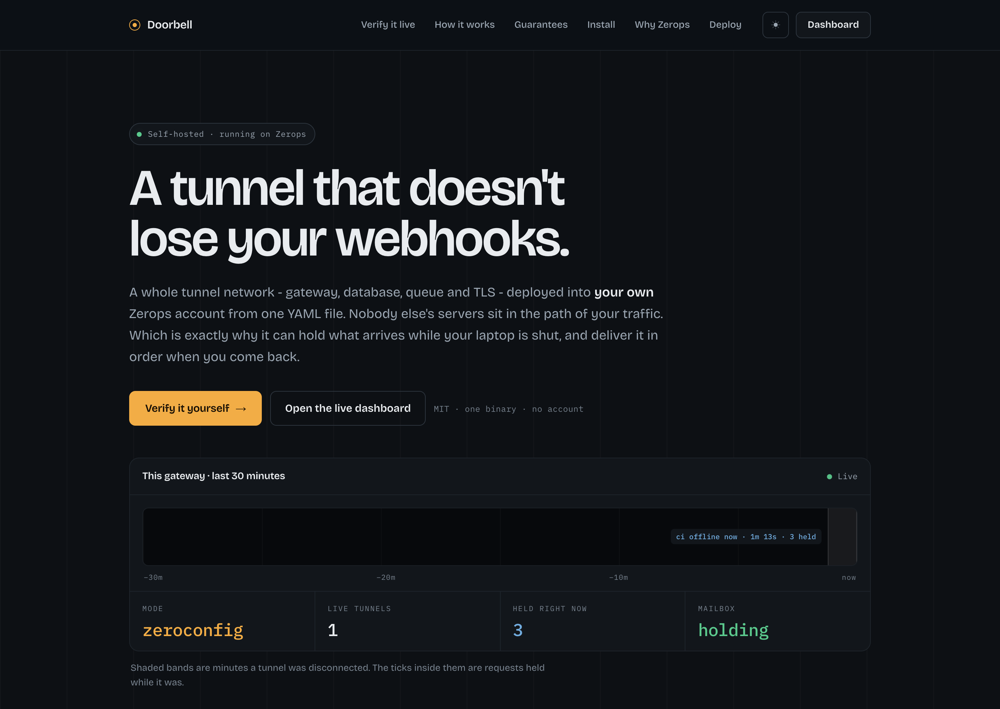
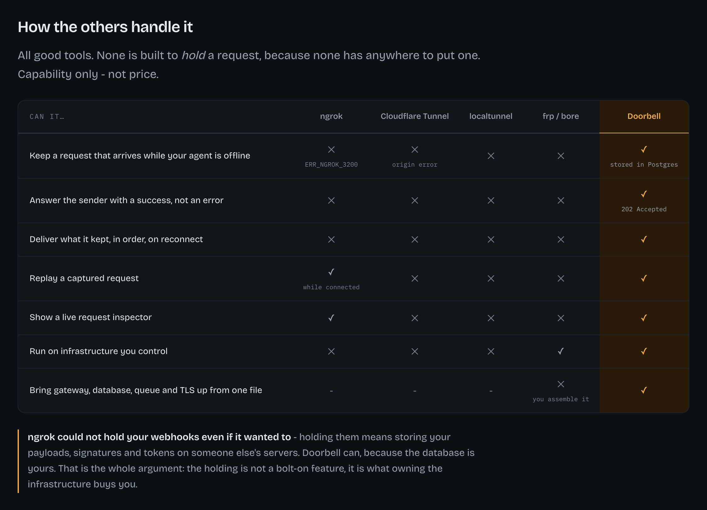
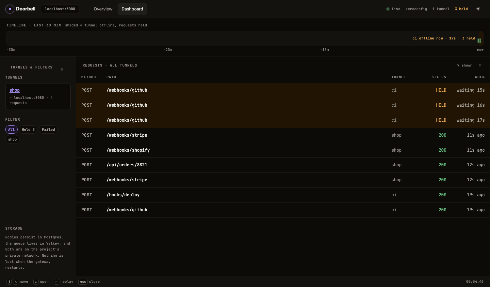
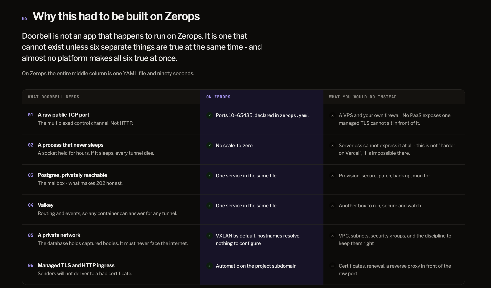

<h1 align="center">Doorbell</h1>

<p align="center">
  <strong>A self-hosted tunnel that doesn't drop requests when your laptop is closed.</strong><br>
  Held, answered <code>202</code>, and delivered in order when you reconnect.
</p>

<p align="center">
  <sub>Built solo for the <strong>WeMakeDevs × Zerops</strong> challenge</sub>
</p>

<p align="center">
  <a href="https://youtu.be/KIYEptODPeo">
    
  </a>
</p>

<p align="center">
  <a href="https://youtu.be/KIYEptODPeo"><strong>▶&nbsp; Watch the 4-minute demo</strong></a><br>
  <sub>The <code>202</code>, the row sitting in Postgres, and the queue draining in order — on camera.</sub>
</p>

<p align="center">
  <a href="#verify-it-yourself-in-30-seconds">Verify it live</a> ·
  <a href="#what-it-guarantees">Guarantees</a> ·
  <a href="#architecture">Architecture</a> ·
  <a href="#security-model">Security</a> ·
  <a href="#why-zerops">Why Zerops</a> ·
  <a href="#run-your-own">Run your own</a> ·
  <a href="#known-limitations">Limitations</a>
</p>

---

## Verify it yourself in 30 seconds

There's a gateway running at
**[gw-2ad0-3000.prg1.zerops.app](https://gw-2ad0-3000.prg1.zerops.app/)**. It has
a tunnel called `shop` reserved, and nothing is connected to it, which is the
same situation as a laptop with the lid shut. You don't need to install anything
or sign up for anything.

**1.** Open the [overview page](https://gw-2ad0-3000.prg1.zerops.app/) and note
the `held right now` counter.

**2.** Send a webhook to that offline tunnel:

```bash
curl -i -X POST https://gw-2ad0-3000.prg1.zerops.app/t/shop/hook -d '{"n":1}'
```

You get **`202 Accepted`** instead of `502`. The request was already in Postgres
by the time that response reached you.

**3.** Reload the page. The counter has gone up by one. That's your request,
sitting in the mailbox.

**4.** Now try a name nobody reserved:

```bash
curl -i -X POST https://gw-2ad0-3000.prg1.zerops.app/t/zzrandom99/hook -d '{"n":1}'
```

**`404`** this time. Only reserved names get held, so nobody can fill up the
mailbox by guessing URLs.

### Open your own tunnel — two more minutes

Those steps show a request being held. To watch one get delivered in order when
you reconnect, you need a tunnel of your own. Still no account or token:

Point it at whatever you're already running. If you don't have anything handy,
this accepts a POST and answers `200` — enough to watch the whole thing work.
`python3 -m http.server` won't do: it only handles GET and replies `501` to the
`curl` below.

```bash
python3 -c "
from http.server import BaseHTTPRequestHandler, HTTPServer
class H(BaseHTTPRequestHandler):
    def do_POST(self):
        self.send_response(200); self.end_headers(); self.wfile.write(b'ok')
    do_GET = do_POST
HTTPServer(('127.0.0.1', 3000), H).serve_forever()"
```

Then, in another terminal:

```bash
go install github.com/BigAchiever/doorbell/cmd/doorbell@latest
export DOORBELL_GATEWAY=2a00:1ed0:1100::160:0:2ad0
doorbell -name pick-something-unused 3000
```

> If you skip that first step you'll get a `502`, and it will look like the thing
> this project claims to fix. It isn't the same failure. Doorbell holds a request
> when *the tunnel* is gone. Here the tunnel is up and your own port is empty, so
> the gateway has somewhere to deliver and nothing there to accept it, which is a
> real error rather than something to hold.
>
> The CLI does say so — it answers the stream itself with
> `doorbell: nothing is listening on 127.0.0.1:3000` — but you won't read that on
> this deployment. Zerops' balancer replaces the body of any `5xx` with its own
> page, so what reaches you is *"Check if your application is running on a correct
> port"*. Roughly the same advice, minus the port it actually tried. The CLI's own
> log line still names it, and running the gateway locally gives you the original.

Pick any name that isn't taken. The gateway sets no client token, so anyone may
connect and claim an unclaimed name — but `shop` is already claimed, and a
reservation belongs to whoever made it. Ask for it and the gateway refuses:

```
doorbell: the name "shop" is reserved by someone else
```

Which is the point of reserving names at all. You can't take someone's URL out
from under them, and you can't walk off with the mailbox behind it.

Send a request and it arrives. Hit `Ctrl-C`, send three more, and each one comes
back `202`. Start the CLI again and they drain oldest first, each showing how
long it waited:

```
$ doorbell -name demo 3000
  https://gw-2ad0-3000.prg1.zerops.app/t/demo/
  → forwarding to 127.0.0.1:3000

  ▲ requests held while you were away are arriving now
  ✓ 11:11:23 POST   /hooks/github                      200  held 4s
  ✓ 11:11:23 POST   /hooks/github                      200  held 2s
  ✓ 11:11:24 POST   /hooks/github                      200  held <1s
```

> This part needs IPv6. A raw TCP port can't go through the HTTP balancer that
> serves everything else. [Known limitations](#known-limitations) explains why.

### Why the dashboard is token-gated

Everything above is open. The dashboard isn't, and that comes down to what it
shows: captured request and response **bodies**, plus `/api/replay`, which
re-fires a stored request at whoever's laptop is on the other end. Leave that
public and the next visitor reads your payloads and can replay them.

The counters and timeline on the overview page stay public, because they only
carry tunnel names and timestamps. [Security model](#security-model) has the
full table.

---

## The problem

Something on the internet needs to POST to code running on your machine. A
payment provider, a git push, a CI callback, an OAuth redirect. Your machine has
no public address, so you open a tunnel. Then you shut the lid and every sender
gets a `502`.

This happens with every tunnel, and the reason is always the same: none of them
has anywhere to put a request while you're gone. Doorbell has somewhere. A
database you own, sitting in the path.

| Every other tunnel | Doorbell |
|---|---|
| Laptop offline → request lost | Laptop offline → request stored |
| Sender gets `502`, starts retrying | Sender gets `202`, stops |
| Reconnect starts from now | Reconnect drains the queue, oldest first |
| Nothing to replay — it never arrived | Any stored request, re-sent on demand |
| Someone else's servers see your payloads | Your project, your database, your network |

ngrok's inspector and replay are good, and they're free. But they can't replay a
request that never reached your machine in the first place.

<p align="center">
  
</p>

---

## What it guarantees

| Guarantee | Mechanism | Limit |
|---|---|---|
| **Nothing is dropped** | Written to Postgres *before* the sender is answered | 200 per tunnel, then oldest-first eviction |
| **Answered immediately** | `202`, so the sender's retry policy never fires | `202` means *stored*, not *your app processed it* |
| **Delivered in order** | The queue drains oldest first | — |
| **Delivered once** | An atomic lease — 8 goroutines race, one wins | Against concurrent drains. A database failure *after* a delivery repeats it; dedupe on `X-Doorbell-Id` |
| **Replayable** | Any stored request, re-sent on demand | Minus the redacted headers below |
| **Stable URL** | Reserved names survive restarts and redeploys | Only reserved names are held |
| **Secrets not stored** | Signing and auth headers redacted before the database | So a held webhook fails signature checks |
| **Visible** | Live bodies, and exactly when a tunnel was offline | Dashboard needs the admin token |

Two things to know before you rely on any of this.

**Signature verification breaks on held requests.** Header names containing
`Signature`, `Token`, `Secret`, `Api-Key` or `Hmac`, plus `Authorization` and
`Cookie`, get redacted before the row is written, so they're already gone by the
time the request is delivered. For Stripe-style signatures that costs you very
little, since they cover a timestamp the held request has fallen outside of
anyway. GitHub's `X-Hub-Signature-256` is an HMAC over the body alone, so a check
that would have passed will now fail. Held requests carry `X-Doorbell-Replay`, so
the usual fix is to skip verification when you see that header. If you'd rather
keep the signatures, narrow `IsSensitive` in `internal/inspect` and accept that
live credentials end up in Postgres.

**Bodies over 1 MiB are refused rather than truncated.** Storing one short would
mean delivering it short with a matching `Content-Length`, and the receiving app
would see malformed input that nobody ever sent.

<p align="center">
  
</p>

<p align="center"><sub>
  <code>ci</code> is offline, so its requests sit marked <b>HELD</b> with how long they have waited.
  <code>shop</code> is connected, so its traffic goes straight through and returns <code>200</code>.
  The shaded band is the outage itself.
</sub></p>

---

## Architecture

```
                    your Zerops project
  ┌──────────────────────────────────────────────────┐
  │                                                  │
  │   :3000  HTTPS ingress ──┐                       │
  │                          ├── gateway ── Postgres │  bodies, reservations
  │   :7000  raw TCP  ───────┘      │      Valkey    │  routes, events
  │                                 │                │
  └─────────────────────────────────┼────────────────┘
                                    │ yamux streams
                          the CLI dialled this, outbound
                                    │
                              localhost:3000
```

The CLI opens **one** outbound TCP connection and keeps it open. Nothing listens
on your machine and nothing gets opened on your router. The gateway never reaches
you; it just answers on a pipe you already dialled.

Requests become [yamux](https://github.com/hashicorp/yamux) streams on that
socket, and `httputil.ReverseProxy` writes into them. Leaning on the standard
library's proxy instead of hand-rolling the framing is why chunked bodies,
keep-alive and WebSocket upgrades all work without any extra code.

**Postgres** stores what has to survive a restart: name reservations and request
bodies. **Valkey** holds what only matters right now, which is who owns which
tunnel, plus the event bus that lets a dashboard on one container display traffic
another container proxied.

### Repository structure

| Path | What it does |
|---|---|
| `cmd/gateway/main.go` | Process lifecycle: wiring, startup, graceful shutdown |
| `cmd/gateway/control.go` | The raw TCP port: accepting and authenticating CLIs |
| `cmd/gateway/proxy.go` | The data path, including forwarding to sibling containers |
| `cmd/gateway/mailbox.go` | Storing requests when no tunnel is connected, and draining them |
| `cmd/gateway/api.go` | JSON and HTML endpoints behind the dashboard |
| `cmd/gateway/auth.go` | The two-token split: control port vs inspector |
| `cmd/gateway/server.go` | HTTP server, routes, middleware |
| `cmd/gateway/config.go` | Environment configuration |
| `cmd/doorbell` | The CLI |
| `internal/tunnel` | The wire protocol both ends speak |
| `internal/registry` | Which tunnels are live on this container |
| `internal/persist` | Postgres: reservations, stored requests, history |
| `internal/routing` | Valkey: the cross-container routing table and event bus |
| `internal/inspect` | The ring buffer and live fan-out behind the dashboard |
| `internal/ratelimit` | Per-client token bucket on the public ingress |
| `internal/dashboard` | The embedded web interface |
| `tools/verify` | Scripts used to check platform behaviour; not part of the build |

---

## Security model

**Two tokens, two privileges.** Opening a tunnel is a small thing to be allowed
to do. Reading the inspector isn't. So they're checked separately:

| Token | Gates | Unset means |
|---|---|---|
| `DOORBELL_CLIENT_TOKEN` | The raw TCP control port | Anyone may open a tunnel |
| `DOORBELL_ADMIN_TOKEN` | Dashboard, operator API, replay | Those surfaces are **unprotected** |

The CLI's `DOORBELL_TOKEN` is checked against the client token and never the
admin one. **Set both to the same value and every tunnel user gets your
inspector.** The public gateway above leaves the client token unset and keeps the
admin token set, so anyone can forward a port but only the operator sees what
went through it.

**What is reachable without credentials:**

| Surface | Public | Why |
|---|---|---|
| `/`, `/assets/*` | yes | Static |
| `/api/info` | yes | Counters only |
| `/api/timeline` | yes | `tunnelId` + timestamps, no bodies or headers |
| `/t/<name>/…` | yes | The tunnel itself — that is the product |
| `/dashboard` | **no** | Serves captured request and response bodies |
| `/api/requests`, `/api/tunnels`, `/api/mailbox`, `/api/stream` | **no** | Same bodies, as JSON |
| `/api/replay/` | **no** | Re-fires a stored request at the tunnel owner's machine |

**Other measures.** Signing and auth headers get redacted before the row is
written, so live credentials never reach Postgres at all. The body and mailbox
caps listed under [What it guarantees](#what-it-guarantees) keep the table from
becoming a way to fill someone's disk, and only holding *reserved* names means
you can't allocate storage by guessing URLs. There's a per-client token bucket on
the public ingress. Postgres and Valkey sit on the project's private network and
are never exposed.

---

## Why Zerops

Doorbell needs six things **at once, on one private network**. Zerops provisions
all six from a single pasted YAML file in about ninety seconds.

| Requirement | Why Doorbell needs it |
|---|---|
| Raw public TCP port | The control channel the CLI dials. Not HTTP |
| A process that never sleeps | A socket held for hours; if it sleeps, every tunnel dies |
| Postgres, privately reachable | The mailbox — what makes `202` an honest answer |
| Valkey | Routing and events across containers |
| A private network | The database holds captured bodies; it must not face the internet |
| Managed TLS and ingress | Senders will not deliver to a bad certificate |

<p align="center">
  
</p>

<details>
<summary><strong>Why not somewhere else?</strong></summary>

Serverless is out before you even start. A function stops existing once it
answers, so there's nothing left holding the socket. Vercel rejects WebSocket
handshakes no matter how you configure it, and a raw TCP listener is further out
of reach than that.

**Honest caveat:** any single one of these six is easy somewhere. A $5 VPS gives
you the raw port. A managed database gives you Postgres. Half of Doorbell is just
an HTTP endpoint writing to Postgres, and that would run almost anywhere. The
tunnel wouldn't, and the tunnel is the product. What I couldn't find elsewhere
was all six together, out of one pasted file.

</details>

---

## Run your own

Needs [Go 1.22+](https://go.dev/dl/). To use a gateway that already exists, skip
to step 2.

**1. Deploy a gateway.** Copy [`zerops-import.yml`](zerops-import.yml), go to
[app.zerops.io](https://app.zerops.io), pick **Import a project using a YAML
template** and paste it in. Takes about 90 seconds. After that there are two
manual steps, because the import schema has no way to express either of them:

```
gw → Public access → Port routing → public 7000 → internal 7000 → tcp
gw → Environment variables → DOORBELL_CONTROL_HOST = <the project's public IP>
```

The second one is what makes your overview page print a control address that
actually accepts connections. Raw ports need an IP that supports them, so that
means IPv6 or a dedicated IPv4. A shared IPv4 won't work.

**2. Install the CLI.**

```bash
go install github.com/BigAchiever/doorbell/cmd/doorbell@latest
```

`go install` puts the binary in `$(go env GOPATH)/bin`, which is often not on
your `PATH`. If `doorbell` comes back as `command not found`, add it:

```bash
echo 'export PATH="$HOME/go/bin:$PATH"' >> ~/.zshrc
source ~/.zshrc
```

Use `~/.bashrc` instead if you're on bash. `which doorbell` should then print the
path to it. There are also prebuilt binaries for macOS, Linux and Windows from
`make release` if you'd rather not touch your shell config.

**3. Connect.**

```bash
export DOORBELL_GATEWAY=<the control address from your overview page>
doorbell -name shop 3000
```

Flags go before the port. Go's `flag` package stops parsing at the first
non-flag argument, so `doorbell 3000 -name shop` prints the usage banner instead
of connecting.

It prints your public URL. Give that to whoever needs to call you once, and it
keeps working across restarts.

### Configuration

| Variable | Default | Meaning |
|---|---|---|
| `PORT` | `3000` | HTTP ingress |
| `CONTROL_PORT` | `7000` | Raw TCP control port |
| `DOORBELL_MODE` | `zeroconfig` | `zeroconfig` or `wildcard` |
| `DOORBELL_BASE_DOMAIN` | — | Required by `wildcard` mode |
| `DOORBELL_CLIENT_TOKEN` | — | Gates the control port. Unset = anyone may open a tunnel |
| `DOORBELL_ADMIN_TOKEN` | — | Gates the dashboard, operator API and replay |
| `DOORBELL_PUBLIC_BASE` | — | External origin, for building tunnel URLs |
| `DOORBELL_CONTROL_HOST` | — | Where clients dial the control port, when that is not the web origin |
| `DATABASE_URL` | — | Postgres. Without it: random names, no mailbox |
| `REDIS_URL` | — | Valkey. Without it: single-container mode |

### Local development

Postgres and Valkey are both optional. Without them you get random names and no
mailbox, but the tunnel itself still works.

```bash
createdb doorbell
DATABASE_URL="postgres://$(whoami)@localhost:5432/doorbell?sslmode=disable" \
REDIS_URL="redis://localhost:6379" \
go run ./cmd/gateway
```

```bash
go run ./cmd/doorbell -gateway localhost 3000
```

---

## Tests

```bash
go test ./... -race
```

**55 tests across 9 packages.** The suites in `internal/persist` and
`internal/routing` need a real Postgres and Valkey, and they **skip** when those
aren't around, so the command above works fine on a machine that has neither. CI
runs both as service containers and **fails the build if they skip**. A green run
that quietly tested nothing is worse than a red one.

If you only read one, read `TestOnlyOneClaimerWinsARow`. Eight goroutines race to
claim the same stored request, and exactly one is allowed to win. Every extra
winner is a webhook someone receives twice.

`make` runs the tests and builds both binaries. `make release` cross-compiles the
CLI into `dist/`.

---

## Known limitations

**The CLI needs IPv6 to reach the public gateway above.** Webhooks don't. The
`curl` at the top of this README runs over plain IPv4, and so do the overview
page and the dashboard, since all of that is HTTP going through Zerops' shared L7
balancer. The control port can't use that path, because the balancer only speaks
HTTP, so a raw TCP port has to be published on the project's own public IP. And
Zerops won't put raw ports on a *shared* IPv4, which it tells you about with
`publicIpTypeNotSupported`. That leaves IPv6 or a paid dedicated IPv4. This
gateway uses IPv6. You'd face the same choice on your own deployment, and it's a
project setting rather than anything in the code.

**Custom-domain mode has never run end to end.** The host routing is implemented
and covered by seven unit cases, including the ones that have to *not* match. The
problem is that Zerops' L7 balancer routes by `Host` before the request ever
reaches the gateway, so pointing a spoofed header at a `*.zerops.app` subdomain
just gets you the balancer's own 404. Testing it properly needs a real domain and
a wildcard certificate. **Routing verified; certificate issuance untested.**

**Zero-config mode is path-based.** A page asking for `/css/app.css` needs that
rewritten to `/t/xyz/css/app.css`. Doorbell covers the common cases, meaning
`Location` headers, `<base href>` and cookie paths, but it won't cover every app.
That's why zero-config is the default for webhooks and a domain is an upgrade you
can take rather than something you need up front.

---

## Troubleshooting

| Symptom | Cause and fix |
|---|---|
| `doorbell: command not found` | `go install` wrote it to `$(go env GOPATH)/bin`, which isn't on your `PATH`. Run `echo 'export PATH="$HOME/go/bin:$PATH"' >> ~/.zshrc` then `source ~/.zshrc` |
| `could not reach the control port` | It is raw TCP, not HTTP. Either a firewall, or port routing was never enabled for 7000, or the IP does not support raw ports — a shared IPv4 does not |
| `invalid token` | The gateway sets `DOORBELL_CLIENT_TOKEN`. Pass it as `DOORBELL_TOKEN`. The admin token will not work |
| Requests return `404` instead of being held | Only *reserved* names are held. Use `-name <something>` |
| `the name "…" is reserved by someone else` | That name was claimed with a different token. Pick another, or present the token that claimed it |
| Dashboard returns `401` | It serves captured bodies, so it needs `DOORBELL_ADMIN_TOKEN` — as `?token=…` once, or an `Authorization: Bearer` header. Tunnels keep working without it |
| A page loads but its CSS 404s | Zero-config mode is path-based; see [Known limitations](#known-limitations) |

---

## How this was built

Solo project, built over the challenge weekend with heavy AI assistance: Claude
Code, running the Opus and Fable models, inside the Antigravity IDE. Between
them they wrote most of the Go, the dashboard and this README.

What it didn't decide was the shape of the thing. That the control channel had to
be a raw TCP port instead of a WebSocket. That the mailbox only holds *reserved*
names, so nobody can fill up storage by guessing URLs. That delivery needed an
atomic lease rather than a read-then-write. And that the client and admin tokens
had to come apart, once it became clear a single token was handing out both a
tunnel and everyone else's captured bodies.

Every platform claim in [Why Zerops](#why-zerops) came from testing it against
the live Zerops API rather than from reading the docs. The scripts are in
[`tools/verify`](tools/verify), including the raw-TCP spike the whole design
rests on, and the one that turned up the fact that a shared IPv4 can't carry a
raw port.

---

## Licence

MIT. See [LICENSE](LICENSE).
